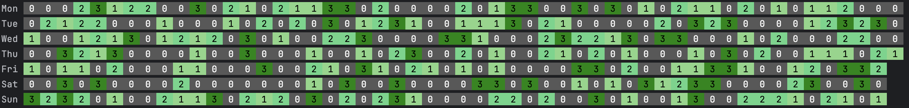

# Gitmap

GitMap is a small Go tool designed to scan a specified directory and its subdirectories for Git repositories, generating a GitHub-style contribution heatmap visualization.



## Features

- Recursively scans directories for Git repositories
- Analyzes commit statistics within a specified date range
- Generates an intuitive contribution heatmap
- Supports multiple time range options: Year, SixMonth, and Month

## Installation

```bash
go get github.com/lachlovy/gitmap
```

Or just download from [Release Page](https://github.com/lachlovy/gitmap/releases).

### Command Line Arguments

- `--scan-dir`: Directory to be scanned (defaults to current directory if not specified)
- `--date-range`: Time range for statistics, supports Year, SixMonth, and Month (defaults to Year)
- `--config-file`: Path to configuration file (not implemented yet)

## Examples

```bash
# Add executable permissions to tool
# gitmap-darwin-arm64 is just an example, please choose a correct version to your os
chmod u+x gitmap-darwin-arm64

# Scan all Git repositories in the current directory and generate a yearly contribution heatmap
gitmap-darwin-arm64

# Scan a specific directory and generate last six-month contribution heatmap
gitmap-darwin-arm64 --scan-dir=/home/user/projects --date-range=SixMonth
```

## Roadmap

- Implement configuration file functionality
- Add more visualization options

## License

MIT

